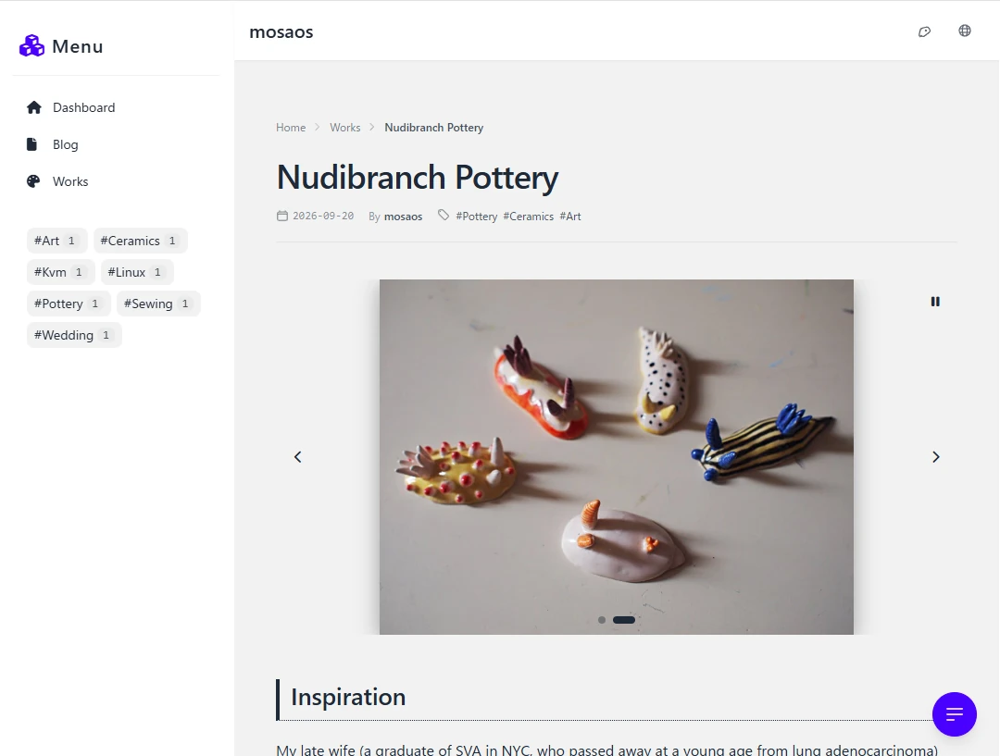
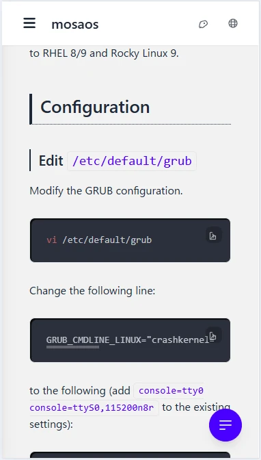
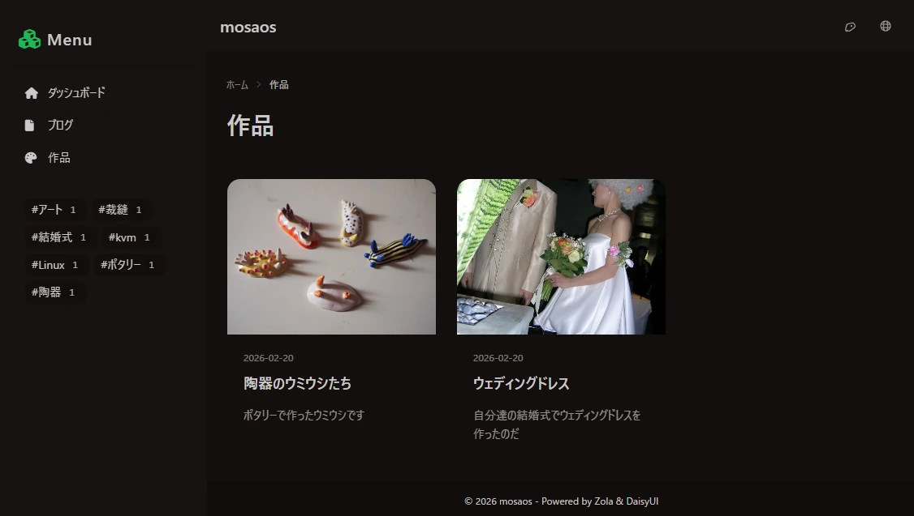

# zola-daisyui-blog

This is a blog (template) built using Zola and daisyUI.
this is my portfolio template.
I created this because I wanted to build my own blog/portfolio.

## Why did I make this ?

I wanted to avoid the maintenance nightmare associated with Node, so I decided to use Zola, an SSG written in Rust.

I built an application using Spring Boot and daisyUI a while back.  
It turned out quite well, so I decided to adopt daisyUI as the UI component library.

- zola
- daisyUI ( tailwind css )

We also use devcontainer to isolate the development environment.

This project was originally created for my personal portfolio and blog.
You can use it as a template for your own portfolio, blog, or small
information-sharing website by adding Markdown files in the same format
as the existing content.

## Features

- **Responsive Design**:  
  Clean and mobile-friendly layout powered by daisyUI and Tailwind CSS.
- **Markdown-based**:  
  Easily write blog posts and portfolio items using Markdown. Articles can also display a Table of Contents (TOC).
- **Multilingual Support**:  
  Built-in multi-language switcher that is scalable for any number of locales.
- **Static Site Generation (SSG)**:  
  Blazing fast, secure, and requires no heavy server-side runtimes (Node.js-free).
- **Dev Containers Support**:  
  Ready-to-use development environment configuration for strict version consistency and easy onboarding.
- **Tag Support**:  
  Organize and filter content efficiently with flexible tagging.
- **Image Carousel / Slideshow**:  
  Built-in responsive carousel to showcase multiple photos and artwork cleanly within your portfolio items.

## System Requirement

- Zola
- VS Code & Dev Containers _(optional)_

I use the following environment.

- Zola : 0.17.2 ( installed on Dev Container )
- OS : Windows 11
- WSL : WSL2
- Docker : docker-ce 28.1.1
- daisyUI : v4.12

---

## How to use this

### Windows

#### Install zola

From CommandLine ( cmd )

```bat
winget install getzola.zola
```

Clone this project.

```bat
git clone <this project url>
```

Navigate to the cloned project root.

```bat
cd <project-root-dir>
```

Start the zola server.

```bat
zola serve --interface 0.0.0.0 --port 1111 --base-url /
```

Open http://localhost:1111/ in your web browser.

### VS Code + Dev Containers

Clone this project.  
\* if you use docker-ce on WSL2, you must create project in a wsl2 directory.

```bash
git clone <this project url>
```

Open with VS Code.

```bash
cd <project-dir>
code.
```

In VS Code, run "Dev Containers: Reopen in container" from the Command Palette.
The dev container will be built and started; please wait a moment.

Once the dev container's terminal becomes available,run the following.

```bash
zola serve --interface 0.0.0.0 --port 1111 --base-url /
```

vscode shows a dialog ( `Your application running on port 1111 is available. See all forwarded ports` ), then click `Open in Browser` button

---

# How to Create Contents

This Zola blog manages content using the following structure and conventions:

- **Directory Structure**:
  - Dedicated `blog/` and `works/` sections are provided.
  - Articles are managed in individual subdirectories (collocated assets), allowing you to keep associated images and files neatly organized right next to the markdown file.

- **Multilingual Support**:
  - The default language (configured in `config.toml`) must use **`index.md`** for its primary content file.
  - Additional languages use locale-specific files (e.g., `index.ja.md`, `index.fr.md`) in the same directory to generate separate localized pages.

- **Front Matter & Metadata**:
  - Refer to existing sample markdown files for the correct Front Matter property structure (such as titles, dates, and tags).

- **Thumbnail Settings**:
  - Thumbnails can be easily defined within the markdown Front Matter (under `[extra]`). Please check the samples for exact syntax.
  - These thumbnail images are also utilized for Open Graph Protocol (OGP) previews when shared on social media.
  - **Recommended OGP Image Size**: 1200px × 630px is recommended for the best preview appearance.

---

## Screenshot







---

## Architectural Options (Usage Styles)

You can use this repository in two different ways depending on your preference:

### Starter Template (All-in-One) *[Easiest]*

Click `Use this template` to create your own repository, and keep both the app and your Markdown content in a single repository.


### Content & App Separation *[Advanced]*

Keep this template as your app/theme base, and manage your Markdown contents in a separate `Private` repository. You can then pull them together dynamically using GitHub Actions during deployment.


---


## How to Setup Zola

\* The following steps are not required for this project(for reference only).

1. Open this project from WSL2
   ```bash
   cd <project-directory>
   code .
   ```
2. `Dev Containers: Reopen in Container`
3. In Terminal window, invoke the below.  
   zola init needs **empty** directory, so create `tmp_zola` directory,
   ```bash
   zola init tmp_zola
   ```
   then, move
   ```bash
   mv tmp_zola/* .
   rm tmp_zola -r
   ```

---
