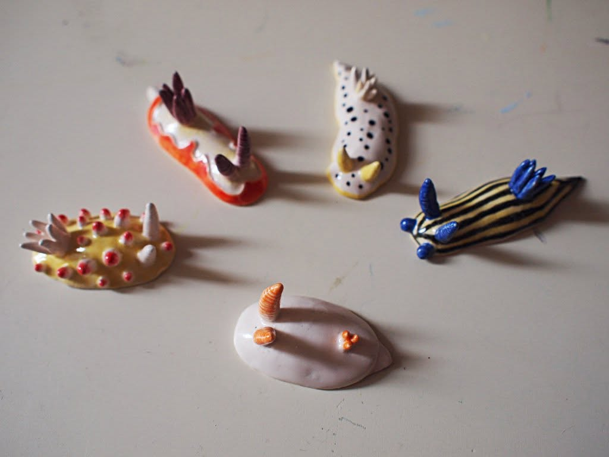
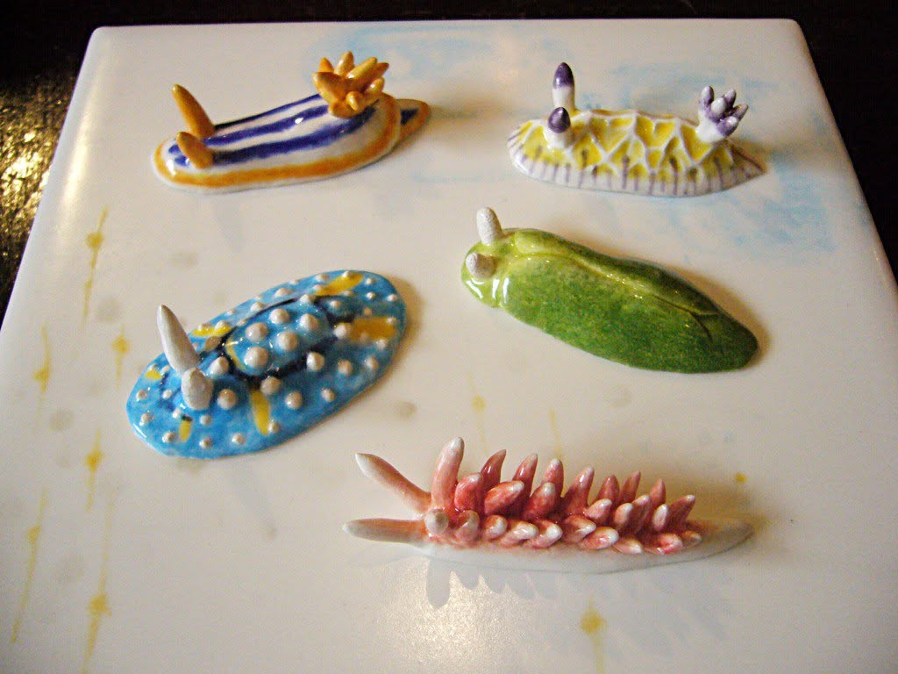

+++
title = "陶器のウミウシたち"
date = "2026-02-20"
description = "ポタリーで作ったウミウシです"

[taxonomies]
tags = ["ポタリー", "陶器", "アート"]

[extra]
thumbnail = "nudibranch-01.jpg"
slideshow = true
+++

## 動機

亡き妻 ( NYC SVA 卒。肺腺癌で夭折 ) がポタリーペインティングを行っていたのだが、私の方ではポタリー粘土で形を作って、いくつかの陶器フィギュアを作っていたことがあった。

ウミウシ。

ウミウシの写真集を見て、美しさに感動した頃の作。

## その後

妻のポタリーの個展などに出品していたのだが、いつのまにか全部いなくなってたのだ。買ってくれた人の下に今もいるかもなのだ。
