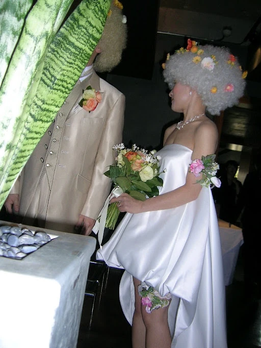
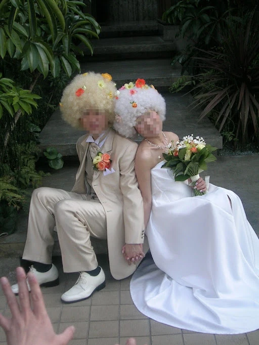

+++
title = "ウェディングドレス"
date = "2026-02-20"
description = "自分達の結婚式でウェディングドレスを作ったのだ"

[taxonomies]
tags = ["結婚式", "裁縫"]

[extra]
thumbnail = "wedding-dress-01.webp"
+++

## なぜ作った？

亡き妻 ( NYC SVA 卒。肺腺癌で夭折 ) は結婚式で自分がイメージしたドレスが来たかったらしく、そのイメージに近いドレスを作製したのだｗ
イメージは妖精。普通のウェディングドレスとは異なる、胸から一枚の布がふわっと広がる感じ。前部分は膝上でくるっと内に巻いている感じで、後ろは普通のウェディングドレスと同様にドレープが自然に流れる感じ。

ドレス選びの時に見たのだが、イメージに合うようなドレスは無し。という事で作ることに(私が..)

## 材料調達

日暮里繊維街に布を探しに行き、トマトで布をゲット。
パニエがないと綺麗なラインにはならないのでパニエも作成(こっちの方が時間がかかった記憶がある)。

このドレス、妻の友人が「着たい！」とかで妻は太っ腹にあげてしまったのだ。

